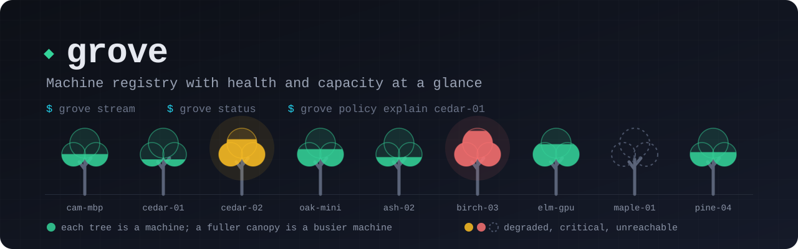

<p align="center"></p>

# Grove

A registry of the machines you reach over SSH, with their health and capacity at a glance.

The name is the idea. A grove is a group of trees tended together: you know each one, you can see at a glance which are thriving and which need attention, and you look after them as a whole. Grove does that for a group of machines, your laptop, a Mac mini under the desk, a couple of Linux boxes, without installing an agent framework or a monitoring stack.

> Status: 0.x. Sampling, streaming, history, alerts, hooks and policy work end to end and the record shapes are meant to stay stable, but commands and flags may still change before 1.0.

## The idea

You want to know, right now, which of your machines is up, how busy each one is, and whether it is a good place to start more work. Most monitoring answers that with a server, a database, dashboards and a daemon on every host. Grove answers it with one binary on your machine and an even smaller one on each of the others.

Each machine runs `grove-probe`, a static binary of about half a megabyte. Every two seconds it reads the kernel's own counters, in-process and without starting any other program, and appends a 128-byte reading to a ring file that holds the last hour. Grove keeps one SSH stream open to each probe. The readings arrive within a second or so, the last hour stays at full resolution, and one sample a minute goes into SQLite for the long view. If a stream drops, Grove reconnects and catches up from the ring, so nothing is missed.

On top of the readings, Grove scores each machine's health, fires alerts when a condition holds for a whole window, runs your own commands when they do, and answers the question every scheduler and agent wants answered before it starts something: may I use this machine now?

```bash
grove status                    # who is up, and how healthy
grove policy explain cedar-01   # exits 0 when cedar-01 may take new work
```

Machines without a probe still work: Grove reads them with a short shell script over SSH instead.

## What it does

- **Registry.** Machines with an endpoint, a port and four free-form labels: trust, privacy, power and locality.
- **Readings.** CPU, load, memory, swap, disk, network, temperatures, GPU, battery, running Claude Code and Codex sessions with what they use, and config state from chezmoi.
- **Health.** One score per machine, 0 to 100, with its band (healthy, degraded, critical) and the metric that costs it most.
- **History.** One sample a minute, kept 90 days by default, with charts in the terminal and a full-screen live board.
- **Alerts and hooks.** Threshold, battery and down rules that fire only when every reading in the window agrees; hooks run your command with the event when they fire or clear.
- **Policy.** Session caps, quiet hours and a fleet-wide warning, and `policy explain` as a gate that fails closed when the evidence is missing.
- **Composable output.** Every command speaks human, `--json` and `--jsonl`.

## How it works

The probe writes, Grove reads. A reading is a fixed 128-byte record with a sequence number at both ends, so a reader can always tell where it is and whether a slot was caught mid-write. `grove stream` follows every probe and writes into a SQLite store at `~/.grove/grove.db`; every other command reads that store, so `status`, `show`, `history` and `graph` answer instantly and work the same while the stream is stopped.

Every reading reaches you as the same record:

```json
{
  "agent_sessions": 3,
  "agents": { "claude": 2, "codex": 1, "cpu_pct": 7.4, "rss_mb": 1630 },
  "cpu_pct": 4.2,
  "disk_used_pct": 52.3,
  "health": { "score": 100, "status": "healthy", "reason": null },
  "hostname": "cedar-01",
  "load1": 0.31,
  "mem_used_pct": 23.8,
  "swap_used_pct": 25.8,
  "taken_at": "2026-10-07T03:58:28.386Z"
}
```

That is a cut-down example; the full shape is in [`docs/commands.md`](docs/commands.md). How the pieces fit is in [`docs/architecture.md`](docs/architecture.md).

## Install

Each release has a build of `grove` and `grove-probe` for macOS and Linux on arm64 and x64, with a `SHA256SUMS` file to check them against.

```bash
version=0.1.3
target=darwin-arm64   # or darwin-x64, linux-arm64, linux-x64
curl -fLO "https://github.com/aaronvanston/grove/releases/download/v$version/grove-$version-$target.tar.gz"
curl -fLO "https://github.com/aaronvanston/grove/releases/download/v$version/SHA256SUMS"
grep " grove-$version-$target.tar.gz$" SHA256SUMS | shasum -a 256 -c -
tar -xzf "grove-$version-$target.tar.gz"
mv grove ~/.local/bin/   # anywhere on your PATH
grove version
```

You don't download the probe yourself. `grove probe install <machine>` fetches the right archive for that machine, checks it against `SHA256SUMS` on your machine, sends it over SSH, and keeps it running under launchd or a systemd user unit. Running it again updates the probe in place.

To build from source instead, with [Rust](https://rustup.rs/):

```bash
git clone https://github.com/aaronvanston/grove.git
cd grove
cargo install --path .
```

## Quick start

```bash
grove add cam-mbp cam-mbp.local --trust personal --power battery
grove add cedar-01 cedar-01 --trust shared --power mains
grove add here localhost                 # this machine, read without SSH
grove probe install cedar-01             # the resident probe, supervised
grove stream                             # collect from every probe; Ctrl+C to stop
grove status                             # reachability and health; exits 1 when any machine is down
grove show cedar-01                      # facts and the latest reading
grove graph cedar-01 --since 1h          # the last hour at full resolution
grove alerts add cpu --above 90 --for 10m
grove hooks add notify 'printf "%s %s is %s\n" "$GROVE_MACHINE" "$GROVE_METRIC" "$GROVE_VALUE" >> ~/grove-alerts.log'
grove policy set --max-sessions 4 --quiet-hours 22:00-07:00
grove policy explain cedar-01 && start-work-on cedar-01
```

Run `grove stream` under your service manager to keep it going. Machines without a probe can be sampled on a schedule instead:

```cron
*/2 * * * * grove sample --json --min-store-interval 110s >/dev/null
```

## Set up

There is nothing to configure before first use. State lives in `~/.grove`: the SQLite database, SSH connection sockets and backups. Set `GROVE_HOME` to relocate it.

| Variable | Meaning |
|---|---|
| `GROVE_HOME` | Where `grove.db`, SSH control sockets and backups live; `~/.grove` by default |
| `GROVE_SSH_COMMAND` | A prefix for the ssh command, such as `ssh -o ControlPath=/tmp/cm-%C`; ssh keeps the first value it sees for an option, so options here win over Grove's |
| `GROVE_CHEZMOI_COMMAND` | The chezmoi binary `drift` reads the config source head with |

SSH runs with your own config, `BatchMode` and connection sharing. Scripts are fed to `sh` on stdin, so nothing depends on the login shell.

## Automation contract

- Structured data goes to stdout; diagnostics go to stderr.
- `--json` emits one versioned envelope, `{command, data, ok, schemaVersion: 1}`; failures emit `{error: {code, message, hint, details}, ok: false, schemaVersion: 1}` on stderr.
- `--jsonl` emits the same envelope as one line; `stream --jsonl` writes `{data, schemaVersion, timestamp, type}` events a line at a time before it, as readings land.
- `status`, `alerts state`, `drift` and `policy explain` are gates: they exit 1 when the answer is no.
- Exit codes: 0 success, 1 failure or a closed gate, 2 usage, 78 configuration.
- Hooks run through `sh -c` with `GROVE_EVENT`, `GROVE_MACHINE`, `GROVE_METRIC`, `GROVE_THRESHOLD`, `GROVE_VALUE`, `GROVE_WINDOW` and `GROVE_AT`, and the event as JSON on stdin. They are killed after 30 seconds and never change an exit code.
- CI, piped and non-interactive execution never prompt or animate. Color honors `NO_COLOR`.

```bash
grove schema --json        # every command, machine-readable
grove describe <command>   # one command's options and examples
grove completion zsh       # shell completions
grove doctor               # local checks
```

## Development

```bash
cargo test                                   # unit tests and the command-line tests
cargo clippy --all-targets -- -D warnings    # lint
cargo run -- list                            # run from source
```

Agents working in this repository should read [`AGENTS.md`](AGENTS.md).

## License

MIT. See [`LICENSE`](LICENSE).
